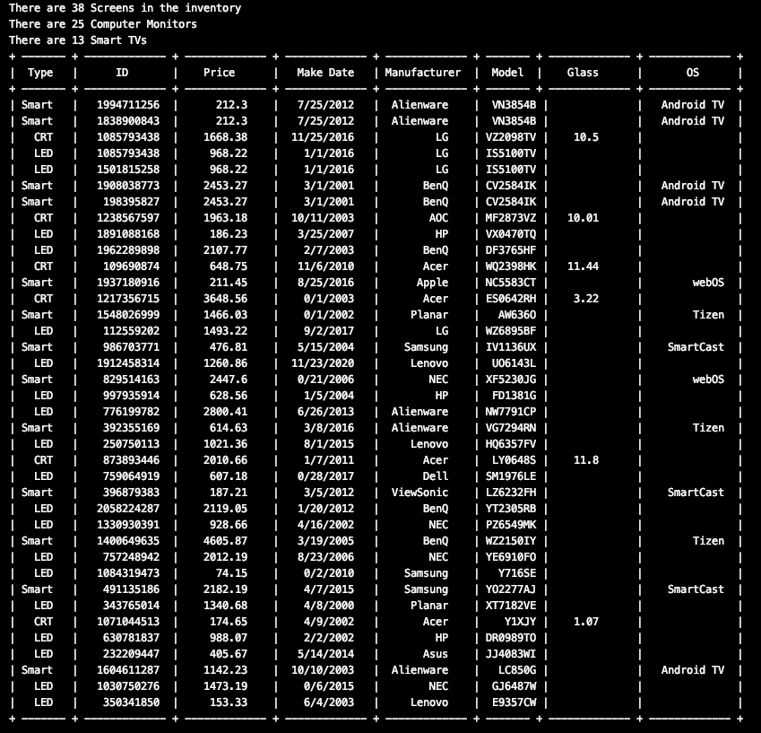

# Inventory Project 
Utilized inheritance capabilties and built a heirachy of classes using Interfaces and Abstract classes.

-- Comments can be found through the java files for through explanation
-- Getters and setters are made for all objects 

Main Abstract Class: Screen

Classes built from Screen
  1. ComputerMonitor
                  1. CRT 
                  2. LED
  2. SmartTv
  
 -- Inventory devices were built from input data 

Inventory Class holds all screen objects 
Methods
        1. Boolean addToInventory()
        2. listComputerMonitor() - returns an arraylist of supertype Computer Monitor
        3. listSmartTv() 

ArrayList for Screen Devices
  -- ArrayLists were used in order to improve code efficiency and increase use of methods provided  by the data structure
  -- try/catch statements are used in order to show messages of duplicate data

ArrayList for ComputerMonitors
-- as we iterate through the list of Inventory which was created above distinguishing all devices we further create CRT and LED objects if theyre identified as computerMonitors by creating instances of them in O(n)
-- the process is the same for listSmartTv

-- Data was formated by iterating through the listInventory 

Input/Testing Data can be found under "Inventory.dat"
- contains duplicate data
- holds data necessary to create screen devices

-- Output should mention duplicate date skipped and inventory count for
  1. Screens
  2. Computer Monitors 
  3. Smart tvs
